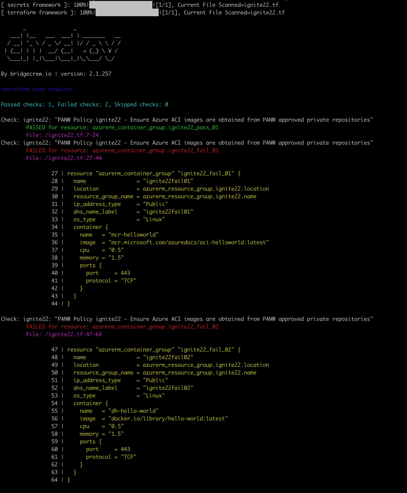
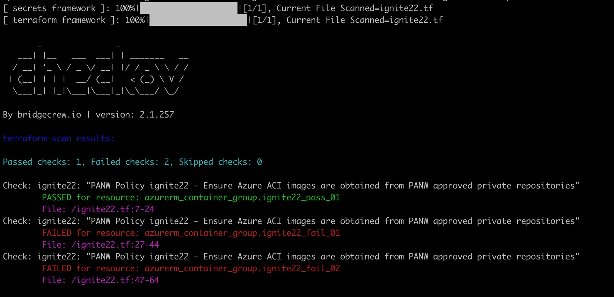
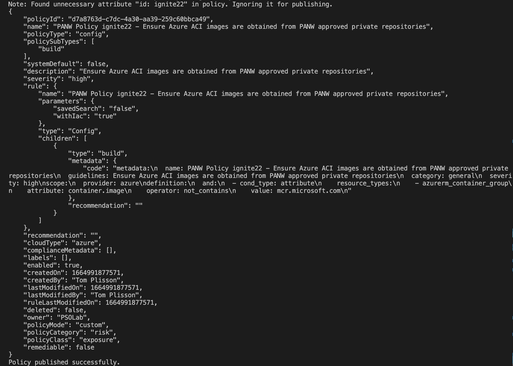
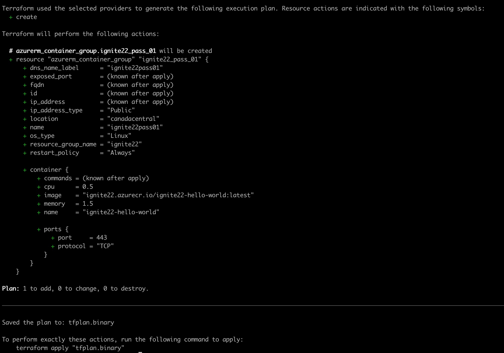
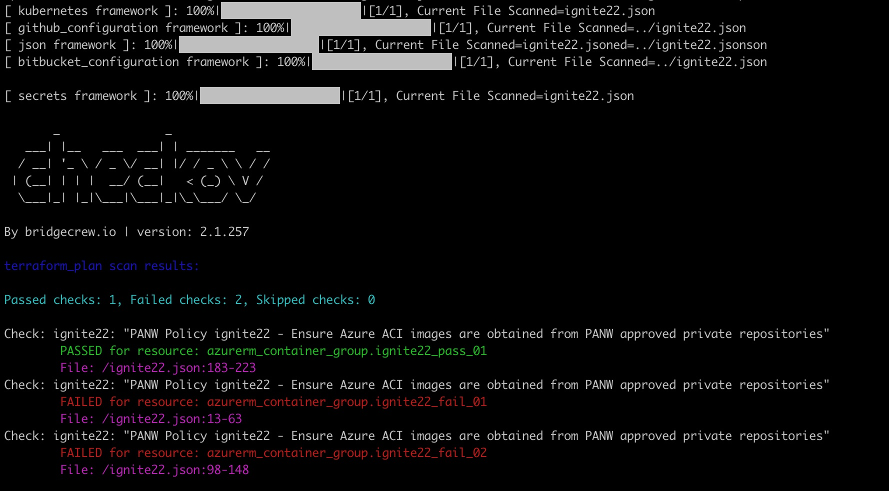

# Code Security PS presentation at Ignite'22

##### This is a simple demo about testing your own custom build policy for Prisma Cloud Code Security (CCS).

Sample custom build policy (YAML format): [ignite22.tf](ignite22.tf)  

`ignite22.tf` 

<details><summary>content</summary>

```hcl
resource "azurerm_resource_group" "ignite22" {
  name     = "ignite22"
  location = "Canada Central"
}

### ACI resource with CORRECT configuration
resource "azurerm_container_group" "ignite22_pass_01" {
  name                = "ignite22pass01"
  location            = azurerm_resource_group.ignite22.location
  resource_group_name = azurerm_resource_group.ignite22.name
  ip_address_type     = "Public"
  dns_name_label      = "ignite22pass01"
  os_type             = "Linux"
  container {
    name   = "ignite22-hello-world"
    image  = "ignite22.azurecr.io/ignite22-hello-world:latest"
    cpu    = "0.5"
    memory = "1.5"
    ports {
      port     = 443
      protocol = "TCP"
    }
  }
}

### ACI resource with INCORRECT configuration
resource "azurerm_container_group" "ignite22_fail_01" {
  name                = "ignite22fail01"
  location            = azurerm_resource_group.ignite22.location
  resource_group_name = azurerm_resource_group.ignite22.name
  ip_address_type     = "Public"
  dns_name_label      = "ignite22fail01"
  os_type             = "Linux"
  container {
    name   = "mcr-helloworld"
    image  = "mcr.microsoft.com/azuredocs/aci-helloworld:latest"
    cpu    = "0.5"
    memory = "1.5"
    ports {
      port     = 443
      protocol = "TCP"
    }
  }
}

### ACI resource with INCORRECT configuration
resource "azurerm_container_group" "ignite22_fail_02" {
  name                = "ignite22fail02"
  location            = azurerm_resource_group.ignite22.location
  resource_group_name = azurerm_resource_group.ignite22.name
  ip_address_type     = "Public"
  dns_name_label      = "ignite22fail02"
  os_type             = "Linux"
  container {
    name   = "dh-hello-world"
    image  = "docker.io/library/hello-world:latest"
    cpu    = "0.5"
    memory = "1.5"
    ports {
      port     = 443
      protocol = "TCP"
    }
  }
}
```

</details>  
<br/>

Sample Terraform HCL file used to verify that our custom policy flags misconfigurations appropriately: [ignite22.yaml](ignite22.yaml)  

`ignite22.yaml:`

<details><summary>content</summary>

```yaml
---
    metadata:
      name: "PANW Policy ignite22 - Ensure Azure ACI images are obtained from PANW approved private repositories" 
      id: ignite22
      guidelines: "Ensure Azure ACI images are obtained from PANW approved private repositories" 
      category: general
      severity: high
    scope:
      provider: azure
    definition:
      and:
        - cond_type: attribute
          resource_types: 
          - azurerm_container_group
          attribute: container.image
          operator: contains
          value: "ignite22.azurecr.io"
``` 

</details>
<br/>

##### Checkov Scan of a Terraform IaC file (in HCL format)

Custom policies can be tested against our sample TF files using [**Checkov**](https://www.checkov.io/)
```console
checkov -f ignite22.tf --external-checks-dir . -c ignite22
```

<details><summary>full output</summary>



</details>
</br>

```console
checkov -f ignite22.tf --external-checks-dir . -c ignite22 --compact
```

<details><summary>compact output</summary>



</details>
</br>

Checkov syntax (for more details check the [Checkov CLI reference](https://www.checkov.io/2.Basics/CLI%20Command%20Reference.html))
```
checkov -f <tf_file> -c <policy_id> --external-checks-dir <path_to_external_yaml_policies>
checkov -d <tf_directory> -c <policy_id> --external-checks-dir <path_to_external_yaml_policies>
```


##### Publishing a custom policy to Prisma Cloud Code Security (CCS)

To publish this new build policy into our CCS tenant, we can use the [`pccs-policy-playground`](https://github.com/kartikp10/pccs-policy-playground) API Script designed by Kartik Pande. This Python script has been copied to the [`pccs`](pccs/) folder.

First, we need to set our API keys as environment variables
```console
export PC_ACCESS_KEY=<KEY>
export PC_SECRET_KEY=<SECRET>
export PRISMA_API_URL=<URL>   e.g. https://api2.prismacloud.io
```

We can then list, publish, update or delete policies from CCS
```
alias pccs="python -m pccs.main"

pccs -h                                              ### Help
pccs -l                                              ### List
pccs -l -q policy.subtype=build                      ### List with query
pccs -p -f <path/policy_filename>                    ### Publish
pccs -u -f <path/policy_filename> -id <policy_id>    ### Update (--enable|disable)
pccs -d -id <policy_id>                              ### Delete
```

Here's how to publish our new custom policy
```console
pccs -p -f ignite22.yaml  
```
<details><summary>output</summary>



</details>
</br>

Here's how to delete it
```console
pccs -d -id d7a8763d-c7dc-4a30-aa39-259c60bbca49
```
```
Deleted successfully.
```


##### Checkov Scan of a Terraform Plan file (in JSON format)

Some scenarios may require you to scan a Terraform Plan file to make sure scans run smoothly in CI/CD pipelines. 

This requires to create a Terraform Plan file in JSON format as described [here](https://www.checkov.io/7.Scan%20Examples/Terraform%20Plan%20Scanning.html).
```console
terraform plan --out ignite22.binary && terraform show -json ignite22.binary | jq . > ignite22.json
```

<details><summary>output</summary>



</details>
</br>

The resulting JSON can then be scanned with Checkov:
```console
checkov -f ignite22.json --external-checks-dir . -c ignite22
```

<details><summary>full output</summary>



</details>
</br>

```console
checkov -f ignite22.json --external-checks-dir . -c ignite22 --compact 
```

<details><summary>compact output</summary>


</details>
</br>