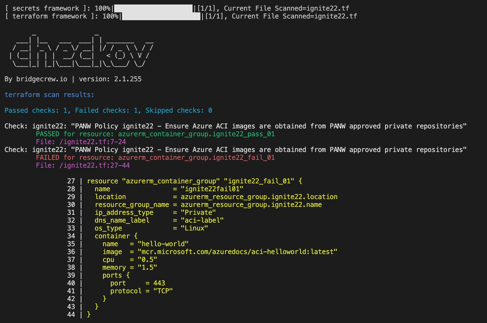

# CCS Presentation at Ignite'22

This is a simple demo about testing your own custom build policy for Prisma Cloud Code Security (CCS).

Sample  custom build policy: [ignite22.tf](ignite22.tf)  
```console
```

Sample Terraform file for testing purposes: [ignite22.yaml](ignite22.yaml)  
```console

```

Custom policies can be tested against sample TF files using [**Checkov**](https://www.checkov.io/)
```console
checkov -f ignite22.tf -c ignite22 --external-checks-dir .
```




Checkov syntax
```
checkov -f <tf_file> -c <policy_id> --external-checks-dir <path_to_external_yaml_policies>
checkov -d <tf_directory> -c <policy_id> --external-checks-dir <path_to_external_yaml_policies>
```

The API Script 
```
alias pccs="python -m pccs.main"

pccs -h                                              ### Help
pccs -l                                              ### List
pccs -l -q policy.subtype=build                      ### List with query
pccs -p -f <path/policy_filename>                    ### Publish
pccs -u -f <path/policy_filename> -id <policy_id>    ### Update (--enable|disable)
pccs -d -id <policy_id>                              ### Delete
```

