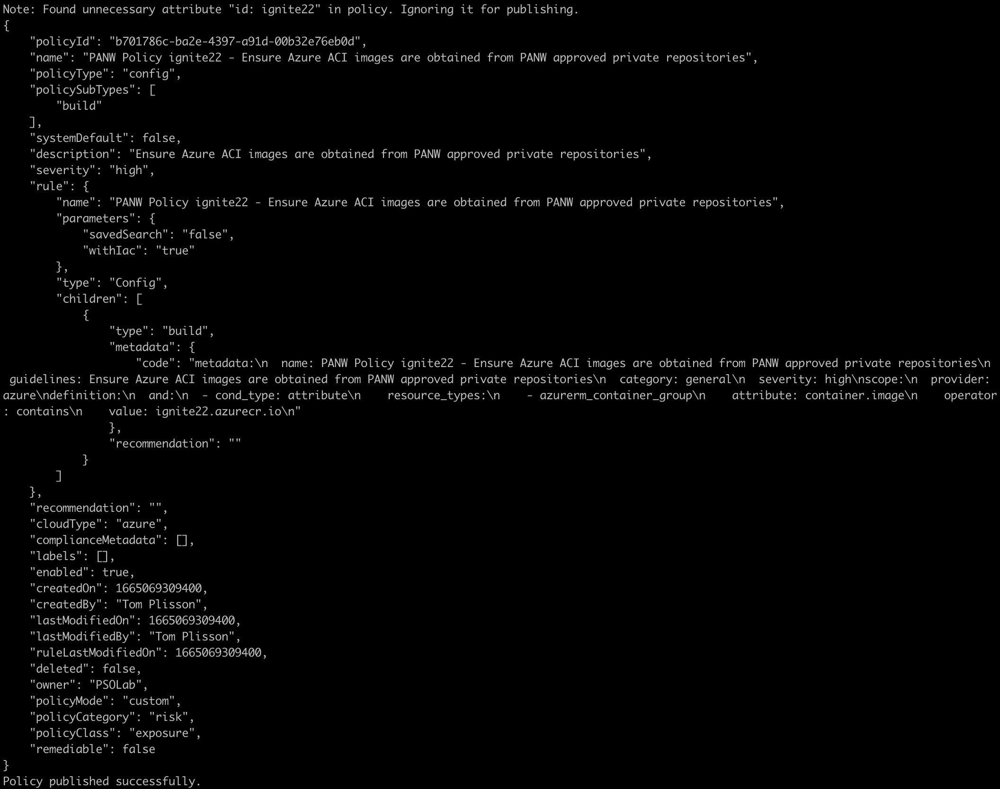

# CCS Presentation at Ignite'22

##### This is a simple demo about testing your own custom build policy for Prisma Cloud Code Security (CCS).

Sample custom build policy (YAML format): [`ignite22.tf`](ignite22.tf)  
```console
```

Sample Terraform HCL file used to verify that our custom policy flags misconfigurations appropriately: [`ignite22.yaml`](ignite22.yaml)  
```console
```

Custom policies can be tested against our sample TF files using [**Checkov**](https://www.checkov.io/)
```console
checkov -f ignite22.tf -c ignite22 --external-checks-dir .
```


Checkov syntax:
```
checkov -f <tf_file> -c <policy_id> --external-checks-dir <path_to_external_yaml_policies>
checkov -d <tf_directory> -c <policy_id> --external-checks-dir <path_to_external_yaml_policies>
```


To publish this new build policy into our CCS tenant, we can use the [`pccs-policy-playground`](https://github.com/kartikp10/pccs-policy-playground) API Script designed by Kartik Pande:

First, we need to set our API keys
```console
export PC_ACCESS_KEY=<KEY>
export PC_SECRET_KEY=<SECRET>
export PRISMA_API_URL=<URL>   e.g. https://api2.prismacloud.io
```

We can then list, publish, update and delete policies from CCS
```
alias pccs="python -m pccs.main"

pccs -h                                              ### Help
pccs -l                                              ### List
pccs -l -q policy.subtype=build                      ### List with query
pccs -p -f <path/policy_filename>                    ### Publish
pccs -u -f <path/policy_filename> -id <policy_id>    ### Update (--enable|disable)
pccs -d -id <policy_id>                              ### Delete
```

Here's how to publish my new custom policy
```console
pccs -p -f ignite22.yaml  
```




Here's how to delete it
```console
pccs -d -id d7a8763d-c7dc-4a30-aa39-259c60bbca49
```
```
Deleted successfully.
```
